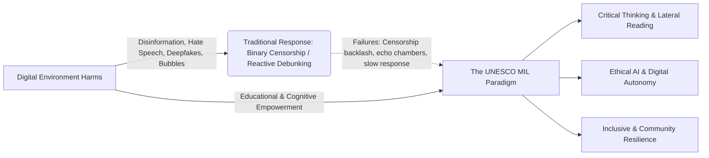
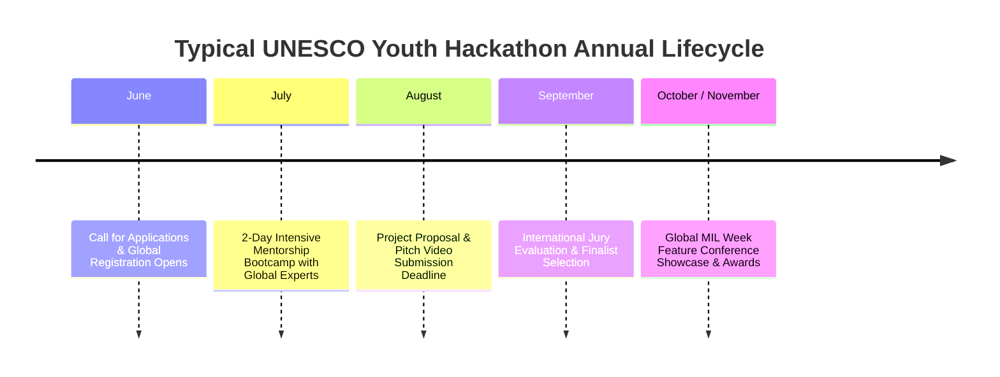

# UNESCO Global MIL Youth Hackathon: Nature of Competition, Timeline, Criteria & Past Winners

**Document Type:** Hackathon Brief & Strategic Intelligence  
**Target Event:** [UNESCO Global Media and Information Literacy (MIL) Youth Hackathon](https://www.unesco.org/en/global-mil-week)  
**Parent Initiative:** [UNESCO Global MIL Week](https://www.unesco.org/en/global-mil-week)  
**Lead Sector:** [UNESCO Communication and Information Sector](https://www.unesco.org/en/communication-information)  
**Audience:** Team Strategy & Submission Preparation  

---

## 1. Nature of the Competition

The **UNESCO Youth Hackathon** is the flagship innovation competition organized annually by UNESCO’s [Communication and Information Sector](https://www.unesco.org/en/communication-information) within the framework of [Global Media and Information Literacy (MIL) Week](https://www.unesco.org/en/global-mil-week).

### Core Mission & Philosophy
Unlike typical commercial software hackathons focused purely on monetization or code velocity, the UNESCO Hackathon is centered on **human-rights-based digital empowerment**. The competition seeks solutions that address digital vulnerabilities—such as algorithmic disinformation, synthetic media (deepfakes), online hate speech, digital surveillance, and echo chambers—by equipping young citizens with **critical thinking, cognitive autonomy, and media literacy skills**.

It builds directly upon the [UNESCO Recommendation on the Ethics of Artificial Intelligence](https://www.unesco.org/en/artificial-intelligence/recommendation-ethics) and the [UNESCO Media and Information Literacy Curriculum](https://unesdoc.unesco.org/ark:/48223/pf0000377068).

### Key Thematic Tracks
1. **[Artificial Intelligence (AI) and MIL](https://www.unesco.org/en/artificial-intelligence):** Ethical use of AI, algorithmic transparency, detecting generative AI manipulation, and synthetic content literacy.
2. **[Media and Information Literacy Education](https://www.unesco.org/en/media-information-literacy):** Gamified toolkits, interactive curricula, and peer-to-peer digital learning models based on the [UNESCO MIL Curriculum for Educators and Learners](https://unesdoc.unesco.org/ark:/48223/pf0000377068).
3. **Community Impact & Inclusion:** Tailoring MIL interventions for vulnerable, marginalized, indigenous, or low-connectivity populations.
4. **Youth Engagement, Leadership & Civic Action:** Countering digital hate speech, harassment, and polarization through youth-led digital citizenship.
5. **Open Innovation Track:** Creative and artistic modalities (interactive storytelling, browser tools, board games, civic tech).

---

## 2. Competition Format & Timeline

### Key Milestone Links & Deliverables
* **Official Call & Announcements:** [UNESCO Global MIL Youth Hackathon Portal](https://www.unesco.org/en/global-mil-week)
* **Partner Network & Mentorship:** Supported by partners like the [Global Forum for Media Development (GFMD)](https://gfmd.info/) and international media education networks.
* **Feature Showcase:** Finalists present their solutions at major international forums such as the [Global MIL Week Feature Conference](https://www.unesco.org/en/global-mil-week) and the [Voices European Festival of Journalism and Media Freedom](https://voicesfestival.eu/).

### Deliverables Required for Submission
Submissions do **not** strictly require an enterprise-ready production deployment, but judges strongly favor **tangible, testable prototypes** (interactive web apps, working browser extensions, playable games) backed by solid documentation:

1. **Project Proposal Document (PDF):**
   - Problem Statement & Target Youth Demographics.
   - Alignment with [UNESCO Media & Information Literacy Curriculum](https://unesdoc.unesco.org/ark:/48223/pf0000377068).
   - Proposed Solution, Features & Methodology (e.g., [SIFT Lateral Reading Framework](https://hapgood.com/2019/06/19/sift-the-four-moves/)).
   - Feasibility, Technical Architecture & Implementation Roadmap.
   - Sustainability, Business/Adoption Model & Ethical Safeguards.
2. **Video Pitch (2 to 3 Minutes):**
   - High-energy demonstration of the problem.
   - Live walkthrough/screen recording of the prototype or extension.
   - Explanation of user impact and future scaling plan.

---

## 3. Judging Criteria & What Evaluators Look For

UNESCO juries consist of international media experts, UNESCO programme specialists, academic researchers, and youth leaders. Submissions are scored on five standard pillars:

| Evaluation Pillar | Weight | What Judges Look For | What to Avoid |
| :--- | :---: | :--- | :--- |
| **Consistency with MIL Principles** | **25%** | Fosters critical thinking, [lateral reading](https://sheg.stanford.edu/civic-online-reasoning), cognitive agency, and freedom of expression. Aligns with [UNESCO MIL guidelines](https://www.unesco.org/en/media-information-literacy). | Black-box "censorship" tools or top-down authoritarian truth filters. |
| **Creativity & Innovation** | **25%** | Novel approach to user engagement; leverages modern tech (e.g., lightweight AI, browser extensions, interactive heuristics). | Generic clones of existing fact-checking blogs or basic static question-answer apps. |
| **Feasibility & Technical Realism** | **20%** | Clear, working prototype; sound technical architecture; practical deployment capability within realistic resources. | Overambitious sci-fi claims without working logic (e.g., "100% accurate AI lie detector"). |
| **Inclusivity & User-Centricity** | **15%** | Accessible design, youth-appealing UI/UX, gender sensitivity, multilingual or localized adaptability. | Overly academic jargon, exclusive desktop-only heavy software, inaccessible UX. |
| **Impact & Scalability Potential** | **15%** | Clear path to adoption by schools, universities, youth clubs, or grassroots digital communities. | One-off static project with no sustainability or community outreach plan. |

---

## 4. Deep-Dive: Analysis of Previous Winning Projects

Studying previous winners reveals the DNA of what wins UNESCO accolades:

### 2025 Winners (Presented at Global MIL Week in Cartagena de Indias, Colombia)
* **Mobile Point (Indonesia):**
  * *Concept:* A mobile application and interactive framework tailored for Gen-Z and Millennials to preemptively tackle viral misinformation.
  * *Winning Factor:* Introduced **"pre-bunking"** game mechanics, interactive debate points, and a critical thinking leaderboard rather than post-facto debunking.
* **International Laureates (Argentina, Cameroon, Viet Nam):** Focused on localized digital safety campaigns, youth-centered AI media education, and civic engagement networks.

### 2024 Winners
* **MILBoard (Indonesia):**
  * *Concept:* An integrated physical board game (gamified snakes-and-ladders) synced with a mobile learning app for youth aged 10–17 in underserved areas.
  * *Winning Factor:* Solved the **digital divide** by blending physical gameplay with digital modules and curriculum-ready challenge cards.
* **[ARTiFAKE](https://artifake.org/en) (Ukraine):**
  * *Concept:* A creative transmedia initiative using street art, murals, digital comic books, and animations to expose disinformation techniques.
  * *Winning Factor:* Highly creative cultural engagement that met youth where they were in public and digital spaces.
* **Idea's Echo (Madagascar):**
  * *Concept:* A youth-led podcast and community radio series translating complex scientific and climate news into regional Malagasy dialects.
  * *Winning Factor:* Extreme focus on linguistic inclusivity and community empowerment.

### 2023 Winners
* **MILES – Media Information Literacy Empowerment Space (Philippines):**
  * *Concept:* An all-in-one digital hub providing youth-friendly MIL learning modules, interactive mini-challenges, and fact-checking kits.
* **MIL Justice League (Cameroon):**
  * *Concept:* Gamified superhero story where users resolve real-life misinformation scenarios.
* **Disagree in Peace (Nigeria):**
  * *Concept:* Creative multimedia (poetry, dance, collaborative digital media) tackling ethnically divisive disinformation and hate speech.
* **YMLAP – Youth Media Literacy Ambassadors Program (Jordan):**
  * *Concept:* A grassroots peer-training ambassador network spreading digital critical thinking among urban youth.

---

## 5. Strategic Takeaways for Our 2026 Submission

1. **Focus on "Pre-bunking" & Cognitive Scaffolding:** Winners do not tell users *what* to think; they train the mind *how* to dissect manipulation.
2. **Contextual & Seamless Integration:** An in-browser tool (like VeriLens) that works directly where browsing happens has immediate day-to-day utility compared to standalone informational websites.
3. **Transparent & Pedagogical AI:** If using AI, highlight its role as a transparent reasoning explainer (identifying fallacy patterns and framing biases) rather than an infallible truth oracle.
4. **Strong Demo & Visual Polish:** A high-fidelity, interactive browser extension demo in the pitch video immediately elevates the project above theoretical slide decks.

---

## 6. Official Reference Links & Useful Resources

* 🌐 **UNESCO Global MIL Week Official Hub:** [https://www.unesco.org/en/global-mil-week](https://www.unesco.org/en/global-mil-week)
* 📖 **UNESCO MIL Curriculum for Educators & Learners (PDF):** [https://unesdoc.unesco.org/ark:/48223/pf0000377068](https://unesdoc.unesco.org/ark:/48223/pf0000377068)
* 🤖 **UNESCO Recommendation on the Ethics of AI:** [https://www.unesco.org/en/artificial-intelligence/recommendation-ethics](https://www.unesco.org/en/artificial-intelligence/recommendation-ethics)
* 🧭 **The SIFT Framework (Mike Caulfield / Hapgood):** [https://hapgood.com/2019/06/19/sift-the-four-moves/](https://hapgood.com/2019/06/19/sift-the-four-moves/)
* 🔍 **Stanford History Education Group (SHEG) – Civic Online Reasoning & Lateral Reading:** [https://sheg.stanford.edu/civic-online-reasoning](https://sheg.stanford.edu/civic-online-reasoning)
* 🌍 **Global Forum for Media Development (GFMD):** [https://gfmd.info/](https://gfmd.info/)
* 🎭 **Voices European Festival of Journalism & Media Freedom:** [https://voicesfestival.eu/](https://voicesfestival.eu/)
* 🎨 **ARTiFAKE Project Portal:** [https://artifake.org/en](https://artifake.org/en)
