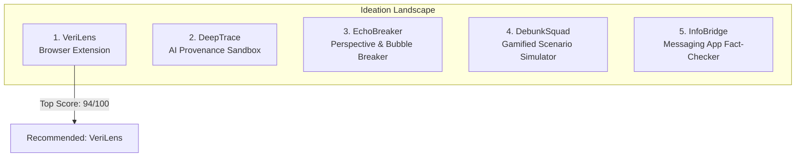
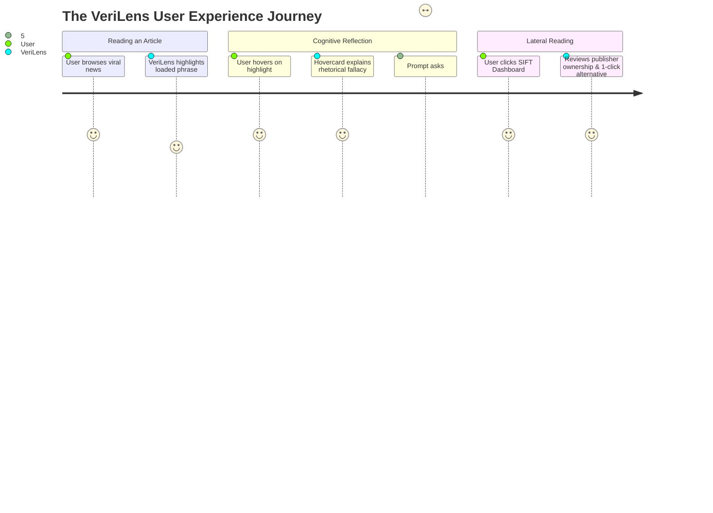

# UNESCO Youth Hackathon: Ideation, Concept Review & Jury Scoring Matrix

**Document Type:** Strategic Ideation & Decision Matrix  
**Project Focus:** Selecting & Refining the Highest-Impact Concept for UNESCO Submission  
**Target:** Winning Entry for Global MIL Youth Hackathon  

---

## 1. Evaluation Framework: What Impresses UNESCO Juries?

To select the winning project, we evaluate ideas through a weighted matrix derived from UNESCO’s judging rubrics and institutional priorities:

1. **Pedagogical Autonomy (25%):** Does the tool foster *cognitive agency* (teaching how to think via SIFT / lateral reading) or does it act as an authoritative *black-box censor*?
2. **UNESCO MIL Alignment (20%):** Direct integration with UNESCO’s Media and Information Literacy framework and the 2026 Theme (*"Play Your Part: Youth Designing the Future of MIL"*).
3. **AI Ethics & Transparency (20%):** Does the solution demonstrate responsible, explainable AI, avoiding algorithmic bias and black-box fallacies?
4. **Feasibility & MVP Demo Impact (20%):** Can a fully interactive, visually stunning prototype be demonstrated on live web content in a 2-3 minute video pitch?
5. **Gen-Z / Youth Daily Utility (15%):** Is it embedded in daily digital life (e.g., social feeds, browser) or is it a burdensome destination site?

---

## 2. Comprehensive Concept Review

---

### Concept 1: VeriLens (AI-Powered Cognitive Companion & Lateral Reading Extension)
* **Format:** Chrome / Chromium Browser Extension (Manifest V3)
* **Core Value Proposition:** An intelligent in-browser companion that detects manipulative framing, emotional outrage triggers, and logical fallacies in real-time, guiding users through the **SIFT** (*Stop, Investigate, Find, Trace*) framework on live articles and social posts.
* **Why Juries Love It:**
  * **Zero Censorship / High Agency:** It doesn't tell users whether an article is "allowed" or "forbidden"; it transparently highlights *how the rhetoric works* and prompts lateral reading.
  * **Instant Visual "Wow" Factor:** During the video pitch, showing real-time highlights appearing dynamically on controversial news articles or social feeds provides an immediate, compelling demo.
  * **Ethical AI Alignment:** Uses LLMs for *linguistic and rhetorical analysis* rather than infallible truth claims.
* **Potential Risks & Mitigations:**
  * *Risk:* Users might see it as annoying if it over-highlights.
  * *Mitigation:* Subtle non-intrusive dotted underlines with graceful hovercards and customizable sensitivity levels.

---

### Concept 2: DeepTrace / ProvenanceLab (Synthetic Media & AI Hallucination Sandbox)
* **Format:** Web Platform + Browser Companion
* **Core Value Proposition:** A verification workbench for students and young journalists to inspect AI-generated images, synthetic text, and reverse-chronology asset origins.
* **Why Juries Love It:** Directly addresses the urgent threat of generative AI deepfakes and algorithmic hallucinations.
* **Limitations:**
  * Technical detection of modern GenAI images/text is inherently brittle and prone to false positives.
  * More focused on expert/journalistic verification workflows than everyday youth media consumption habits.

---

### Concept 3: EchoBreaker / PerspectivePulse (Algorithmic Bubble Breaker)
* **Format:** Web Application + Reader Mode Overlay
* **Core Value Proposition:** Compares how the same breaking news event is framed across 3-4 distinct media spectrums (international, local, state-owned, independent) and highlights consensus facts vs. editorial spin.
* **Why Juries Love It:** Promotes media plurality and cross-cultural understanding.
* **Limitations:**
  * Relies heavily on third-party multi-source news APIs which can have rate limits or coverage gaps for regional non-Western events.

---

### Concept 4: DebunkSquad Academy (Branching Scenario Simulator for Classrooms)
* **Format:** Interactive Web Game (SPA)
* **Core Value Proposition:** A choose-your-own-adventure simulation where students roleplay as digital investigators navigating viral crises (e.g., deepfaked school principal audio, election disinformation bots).
* **Why Juries Love It:** Highly scalable for school curricula and community workshops.
* **Limitations:**
  * Static scenario-based content requires continuous manual writing; lacks the dynamic real-world utility of a live browser tool.

---

### Concept 5: InfoBridge / ChatShield (Grassroots Messaging App Pre-Bunking Bot)
* **Format:** WhatsApp / Telegram Bot + Lightweight Web Registry
* **Core Value Proposition:** A lightweight tool for family group chats in high-risk rumor environments (e.g., natural disasters, elections) that offers localized debunk summaries.
* **Why Juries Love It:** Tremendous community impact for developing markets.
* **Limitations:**
  * Messaging platforms (Meta/WhatsApp) impose severe API costs, strict rate limits, and privacy sandbox restrictions that make hackathon demoing difficult.

---

## 3. Comparative Scoring Matrix

| Evaluation Criteria | Weight | VeriLens (Ext) | DeepTrace (AI) | EchoBreaker | DebunkSquad (Game) | InfoBridge (Bot) |
| :--- | :---: | :---: | :---: | :---: | :---: | :---: |
| **Pedagogical Autonomy & SIFT Model** | 25% | **24 / 25** | 19 / 25 | 22 / 25 | 21 / 25 | 18 / 25 |
| **UNESCO MIL & AI Ethics Alignment** | 20% | **19 / 20** | 18 / 20 | 17 / 20 | 18 / 20 | 17 / 20 |
| **MVP Feasibility & Demo "Wow" Factor** | 20% | **19 / 20** | 16 / 20 | 15 / 20 | 17 / 20 | 14 / 20 |
| **Technical Realism & Reliability** | 20% | **18 / 20** | 14 / 20 | 16 / 20 | 18 / 20 | 14 / 20 |
| **Youth Daily Habit Integration** | 15% | **14 / 15** | 11 / 15 | 12 / 15 | 10 / 15 | 13 / 15 |
| **TOTAL SCORE** | **100%** | **94 / 100** | **78 / 100** | **82 / 100** | **84 / 100** | **76 / 100** |

---

## 4. Winning Strategy: Why VeriLens is the Clear #1 Choice

### Strategic Reasons for Choosing VeriLens:

1. **Direct Solution to the "Censorship Backfire" Problem:**  
   Most tech submissions build "truth arbiters" that trigger user resistance. VeriLens positions itself strictly as a **"Cognitive Gym for the Mind"**, empowering the user's discernment.
2. **Contextual Learning ("In Situ"):**  
   Rather than asking users to visit a separate website, VeriLens delivers micro-learning directly inside the pages they already read every day.
3. **Flawless Demo Experience for Pitch Video:**  
   Showing the extension scan a live controversial article, highlight manipulative headlines, and trigger a SIFT source card produces a 10/10 visual demo.
4. **Feasible MVP Scope:**  
   Can be developed rapidly with standard web technologies (Manifest V3, HTML/CSS/JS, lightweight API integration) without expensive infrastructure dependencies.
