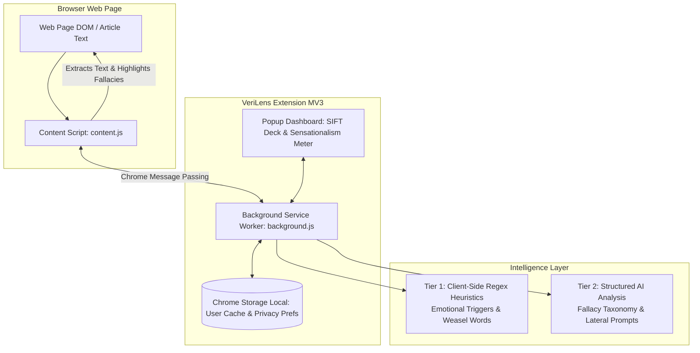
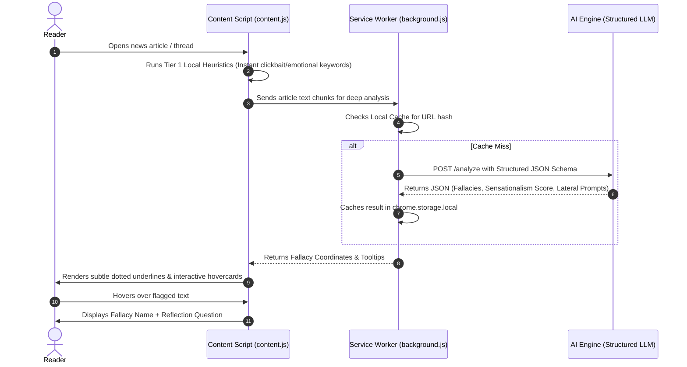

# VeriLens: High-Level Architecture, System Design & Implementation Blueprint

**Project Name:** VeriLens (AI-Powered Cognitive Companion for Media Literacy)  
**Target Platform:** Chromium Browser Extension (Chrome, Edge, Brave) – Manifest V3  
**Document Type:** Technical Architecture, Data Flows, and Code Blueprint  
**Audience:** Development, UI Design & UNESCO Proposal Documentation  

---

## 1. System Overview & Core Principles

**VeriLens** is an open-source browser extension designed to cultivate critical thinking skills in digital spaces. Instead of imposing black-box censorship, VeriLens acts as a **real-time cognitive trainer** using the **SIFT Framework** (*Stop, Investigate the source, Find better coverage, Trace claims*).



---

## 2. Architectural Design & File Structure

```
verilens-extension/
├── manifest.json                 # Manifest V3 configuration & permission boundaries
├── icons/                        # Extension icons (16, 32, 48, 128px)
├── src/
│   ├── background/
│   │   └── background.js         # Service worker: manages API calls, caching & badge states
│   ├── content/
│   │   ├── content.js            # DOM extractor, inline text highlighter & tooltip generator
│   │   └── content.css           # Unobtrusive styling for in-page badges & hovercards
│   ├── popup/
│   │   ├── popup.html            # SIFT Dashboard, Page Sensationalism Gauge & Source Dossier
│   │   ├── popup.css             # Modern typography & responsive dark/light UI
│   │   └── popup.js              # Renders metrics, triggers lateral searches & manages state
│   ├── options/
│   │   ├── options.html          # User settings (sensitivity level, API key, privacy mode)
│   │   └── options.js            # Saves user configurations to chrome.storage
│   └── shared/
│       ├── fallacies.json        # Standardized taxonomy of 15 logical & rhetorical fallacies
│       ├── heuristics.js         # Fast client-side keyword & pattern matchers
│       └── sifter.js             # Lateral reading search query generator
```

---

## 3. Core Component Breakdown

### 1. `manifest.json` (Manifest V3 Compliance)
Strictly adheres to Chrome MV3 security practices:
- Uses `activeTab` to ensure permissions are only active on explicit user engagement or current article domains.
- Stores user progress and cached analyses locally via `storage`.
- Declares `declarativeNetRequest` / scripting rules cleanly without executing arbitrary remote code.

```json
{
  "manifest_version": 3,
  "name": "VeriLens - AI Cognitive Companion for Media Literacy",
  "version": "1.0.0",
  "description": "Real-time rhetorical fallacy detector and SIFT lateral reading companion.",
  "permissions": [
    "activeTab",
    "storage",
    "scripting"
  ],
  "host_permissions": [
    "https://*/*"
  ],
  "background": {
    "service_worker": "src/background/background.js"
  },
  "content_scripts": [
    {
      "matches": ["https://*/*", "http://*/*"],
      "js": ["src/shared/heuristics.js", "src/content/content.js"],
      "css": ["src/content/content.css"],
      "run_at": "document_idle"
    }
  ],
  "action": {
    "default_popup": "src/popup/popup.html",
    "default_icon": {
      "16": "icons/icon16.png",
      "48": "icons/icon48.png",
      "128": "icons/icon128.png"
    }
  }
}
```

---

### 2. Tiered Intelligence Engine (Hybrid Heuristic + LLM)

To ensure zero browsing lag and high cost-efficiency, analysis uses a two-tier pipeline:



---

### 3. Structured Data Schema

#### A. Fallacy & Manipulation Response Schema
The AI analysis returns structured JSON with clear educational metadata:

```json
{
  "page_metadata": {
    "title": "Shocking Truth Politicians Don't Want You to Know",
    "sensationalism_index": 78,
    "primary_tone": "Outrage / Fear Induction",
    "source_attribution_grade": "Low (No peer-reviewed or verifiable sources cited)"
  },
  "detected_patterns": [
    {
      "id": "fallacy_1",
      "target_quote": "Either you support this entire bill or you hate the working class.",
      "category": "False Dilemma (Black-and-White Fallacy)",
      "severity": "High",
      "explanation": "Forces the reader into two extreme opposing camps while ignoring valid middle-ground solutions.",
      "reflection_prompt": "What other compromises or alternative perspectives might exist beyond these two extremes?",
      "mil_skill_highlight": "Evaluate Nuance & Alternative Framings"
    },
    {
      "id": "fallacy_2",
      "target_quote": "Leading scientists all agree without a doubt...",
      "category": "Weasel Words / Unsubstantiated Authority",
      "severity": "Medium",
      "explanation": "Uses vague universal attribution without citing specific studies, institutions, or data.",
      "reflection_prompt": "Which specific institutions or named researchers conducted this research?",
      "mil_skill_highlight": "Trace Claims to Primary Sources"
    }
  ],
  "sift_recommendations": {
    "lateral_search_queries": [
      "bill impact analysis independent economy institute",
      "fact check leading scientists study claim"
    ],
    "verification_checklist": [
      "Check if author has a declared conflict of interest",
      "Look for primary data tables rather than editorial commentary"
    ]
  }
}
```

---

## 4. UI/UX Specifications

### In-Page Hovercard (Content Script UI)
* **Underline Design:** Non-disruptive amber/rose dashed underline (`border-bottom: 2px dashed rgba(234, 88, 12, 0.6)`).
* **Hover State:** Displays a sleek card with:
  1. **Badge:** Fallacy category (e.g. `[False Dilemma]`, `[Ad Hominem]`).
  2. **Plain Explanation:** 1–2 sentences explaining the rhetorical trick.
  3. **Cognitive Prompt:** Highlighted in indigo pill: *"Ask Yourself: ...?"*

### Popup Dashboard (SIFT Command Center)
1. **Header:** Current Domain Trust Dossier (WHOIS age, ownership type, known editorial charter).
2. **Sensationalism Dial:** 0–100 scale (Informative ➔ Nuanced ➔ Sensationalist ➔ Inflammatory).
3. **SIFT Action Cards:**
   - **S (Stop):** Emotional temperature badge.
   - **I (Investigate):** Publisher background snippet.
   - **F (Find):** 1-click button to launch Google News / Wikipedia lateral search for consensus coverage.
   - **T (Trace):** List of extracted hyperlinks and external citations found in the article.
4. **"Cognitive Gym" Tracker:** Shows personal stats (e.g., *"18 fallacies spotted this week | 4 lateral searches conducted"*).

---

## 5. Security, Privacy & Ethics Safeguards

* **Zero Continuous Scraping:** VeriLens only parses DOM content on demand; it does not collect user keystrokes, personal passwords, or private browsing history.
* **Client-Side First:** All heuristic scoring, user reading stats, and personal streaks are stored in `chrome.storage.local` on the user's machine.
* **Transparent Reasoning:** Every warning provides an educational explanation; the user is never told "Do not read this."

---

## 6. Development & Pitch Video Roadmap

| Phase | Milestone | Deliverable |
| :--- | :--- | :--- |
| **Phase 1** | Scaffolding & Manifest V3 Setup | Working Chrome extension loaded in Developer Mode (`manifest.json`, popup skeleton). |
| **Phase 2** | Text Parsing & Local Heuristics | In-page DOM text tokenizer that identifies loaded terms and injects hover tooltips. |
| **Phase 3** | AI Pipeline Integration | Integration with LLM API returning structured JSON fallacy breakdowns. |
| **Phase 4** | SIFT Dashboard UI & Lateral Search | Polished popup dashboard with sensationalism gauge and 1-click lateral queries. |
| **Phase 5** | Video Pitch Screen Recording | 2-minute demo showing VeriLens live on a sensationalist news article and social post. |
